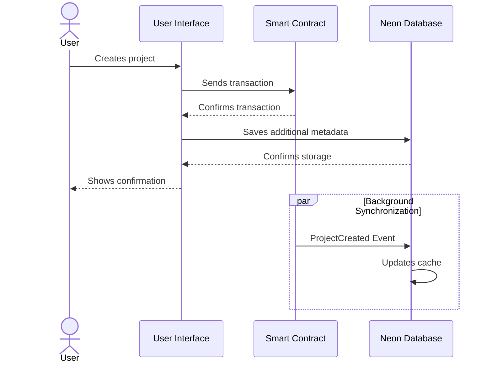
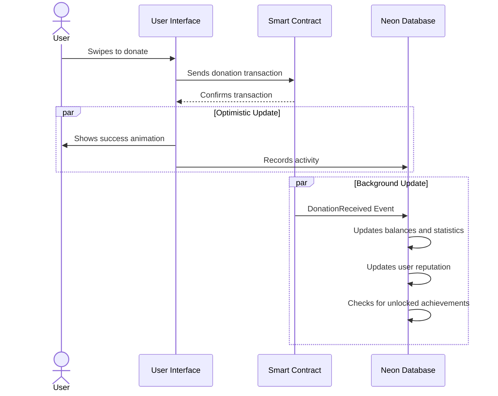
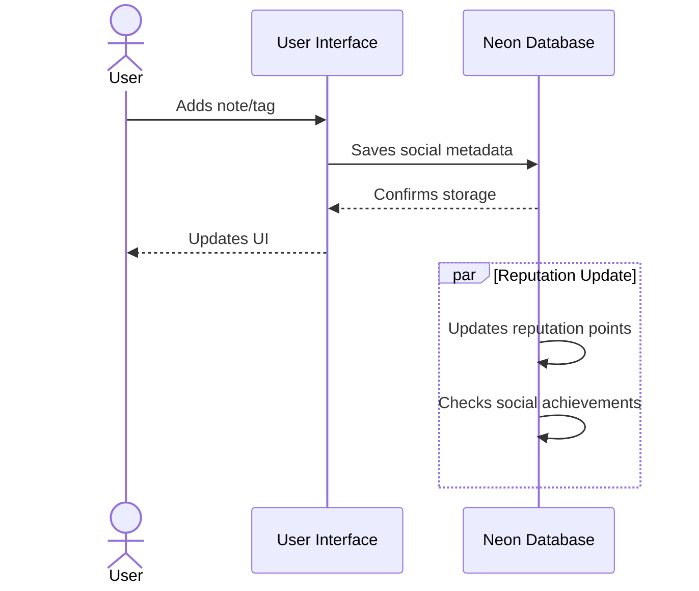

# SwipePad Architecture

This document describes the global architecture of the SwipePad project, a donation platform with social features that combines blockchain and traditional databases.

## Overview

SwipePad is a decentralized application (dApp) built on the Celo network that allows users to:

1. Create funding projects
2. Donate to projects with a simple swipe gesture
3. Maintain a social and reputation profile
4. Participate in the community by adding tags and comments
5. Follow other users and view their activity

## Architecture Diagram

```
┌─────────────────────────────────────────────────────────────────────────┐
│                                                                         │
│                            FRONTEND (Next.js)                           │
│                                                                         │
│  ┌──────────────┐  ┌────────────────┐  ┌───────────────┐  ┌──────────┐  │
│  │ UI           │  │ Server Actions │  │ API Routes    │  │ Hooks     │  │
│  │ Components   │  │ (Next.js)      │  │ (Next.js)     │  │ (React)   │  │
│  └──────┬───────┘  └───────┬────────┘  └───────┬───────┘  └─────┬────┘  │
│         │                  │                   │                 │       │
└─────────┼──────────────────┼───────────────────┼─────────────────┼───────┘
           │                  │                   │                 │        
           │                  │                   │                 │        
┌──────────┼──────────────────┼───────────────────┼─────────────────┼───────┐
│          │                  │                   │                 │       │
│  ┌───────▼──────────────────▼───────┐ ┌─────────▼─────────────────▼─────┐ │
│  │                                  │ │                                 │ │
│  │      Neon Database                │ │      Blockchain (Celo)          │ │
│  │      (PostgreSQL)                 │ │                                 │ │
│  │                                  │ │                                 │ │
│  │  ┌─────────────┐  ┌────────────┐ │ │  ┌──────────────┐  ┌──────────┐ │ │
│  │  │ User        │  │ Project    │ │ │  │ DonationPool │  │ ERC-20   │ │ │
│  │  │ Data        │◄─┐│ Metadata  │ │ │  │ Contract     │  │ Tokens   │ │ │
│  │  └─────────────┘  │└────────────┘ │ │  └──────┬───────┘  └──────────┘ │ │
│  │  ┌─────────────┐  │               │ │         │                      │ │
│  │  │ Social      │◄─┘               │ │         │                      │ │
│  │  │ Data        │                  │ │         │                      │ │
│  │  └─────────────┘                  │ │         │                      │ │
│  │  ┌─────────────┐                  │ │         │                      │ │
│  │  │ Blockchain  │◄─────────────────┼─┼─────────┘                      │ │
│  │  │ Cache       │                  │ │                                 │ │
│  │  └─────────────┘                  │ │                                 │ │
│  └──────────────────────────────────┘ └─────────────────────────────────┘ │
│                                                                           │
│                        INFRASTRUCTURE LAYER                               │
└───────────────────────────────────────────────────────────────────────────┘
```

## Main Components

### 1. Frontend (Next.js App Router)

- **UI Components**: Reactive user interface built with React, TailwindCSS, and Shadcn UI
- **Client State**: State management with React Hooks and Context API
- **Server Components**: Server-rendered components for SEO and performance
- **Server Actions**: Server functions for data operations
- **API Routes**: REST endpoints for database and blockchain interactions

### 2. Backend (Serverless)

#### 2.1 Blockchain (Celo Network)

- **DonationPool Smart Contract**: Main contract managing projects and donations
- **ERC-20 Tokens**: Support for donations in multiple tokens
- **Events**: Event system for synchronization with the database
- **Interaction via Wagmi/Viem**: Library for smart contract interaction

#### 2.2 Database (Neon PostgreSQL)

- **User Module**: Profiles, achievements, reputation, and settings
- **Social Module**: User connections, activity, community notes
- **Project Module**: Metadata, categories, tags
- **Blockchain Cache**: Indexed data from the blockchain for quick access

#### 2.3 Backend Services

- **Blockchain Indexer**: Service that synchronizes blockchain events with the database
- **Authentication with NextAuth**: User authentication with wallets
- **Cron Jobs**: Scheduled tasks for maintenance and synchronization

## Data Flow

### 1. Project Creation



### 2. Project Donation



### 3. Social Interaction



## Storage Strategy

The architecture uses a hybrid approach for data storage:

1. **Critical Data on Blockchain**:
   - Projects and their essential details
   - Donations and financial transactions
   - Ownership and permissions

2. **Social Data and Metadata in Neon**:
   - User profiles and preferences
   - Connections between users
   - Tags, notes, and votes
   - Achievements and reputation points
   - Metrics and statistics

3. **Blockchain Cache**:
   - Replica of blockchain data for quick reading
   - Updated by an indexing service

## Security

- **Authentication**: Sign-In with Ethereum (SIWE) for wallet-based authentication
- **Authorization**: Access control based on on-chain ownership
- **Validation**: Cross-verification between off-chain and on-chain data
- **API Protection**: Protected endpoints with authentication
- **Optimistic Updates**: Improves UX while maintaining eventual consistency

## Scalability

- **Serverless Architecture**: Automatic scaling with Vercel
- **Serverless Database**: Neon PostgreSQL scales according to demand
- **Aggressive Caching**: Minimizes blockchain reads
- **Efficient Indexing**: Batch processing of blockchain events

## Implementation Plan

### Phase 1: MVP (Minimum Viable Product)

- DonationPool contract on testnet (Celo Alfajores)
- Basic functionality for creating and donating to projects
- Simple user profiles
- User interface with swipe functionality

### Phase 2: Social Features

- Reputation system and achievements
- Community notes and tagging
- User connections
- Rankings and leaderboards

### Phase 3: Optimizations and Scalability

- Efficient event indexing
- Performance improvements
- Load testing
- Deployment to mainnet

## Next Steps

1. Set up local development environment with Neon DB
2. Implement and test contracts on testnet
3. Develop main UI components
4. Implement wallet authentication system
5. Create indexing and synchronization services

## Conclusion

This hybrid architecture provides the best of both worlds:

- **Trust and transparency** of blockchain for financial transactions
- **Performance and flexibility** of a relational database for social features
- **Smooth user experience** thanks to optimistic design and efficient caching

The combination of blockchain and traditional technologies allows for creating a unique social donation experience, maintaining reasonable operational costs and allowing for easy scalability. 