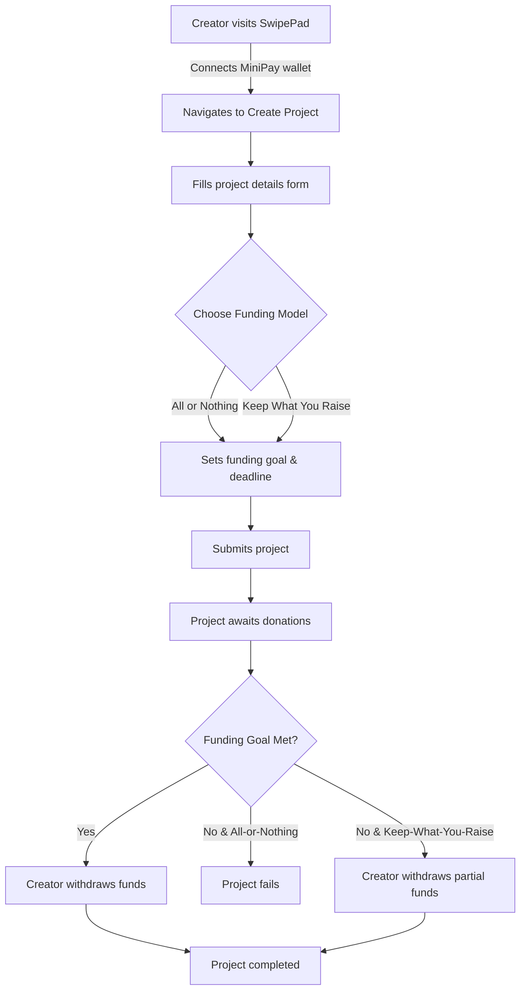
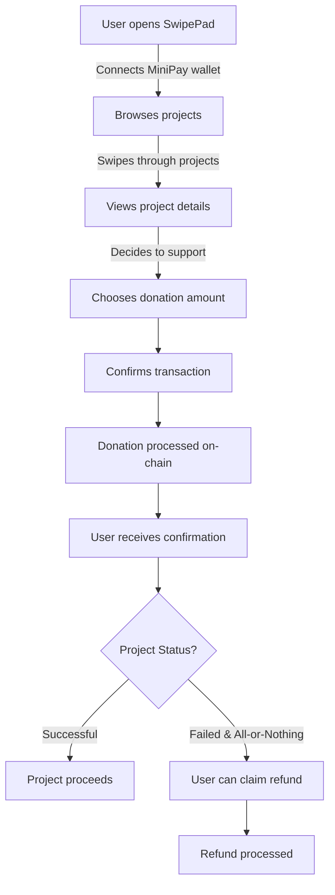
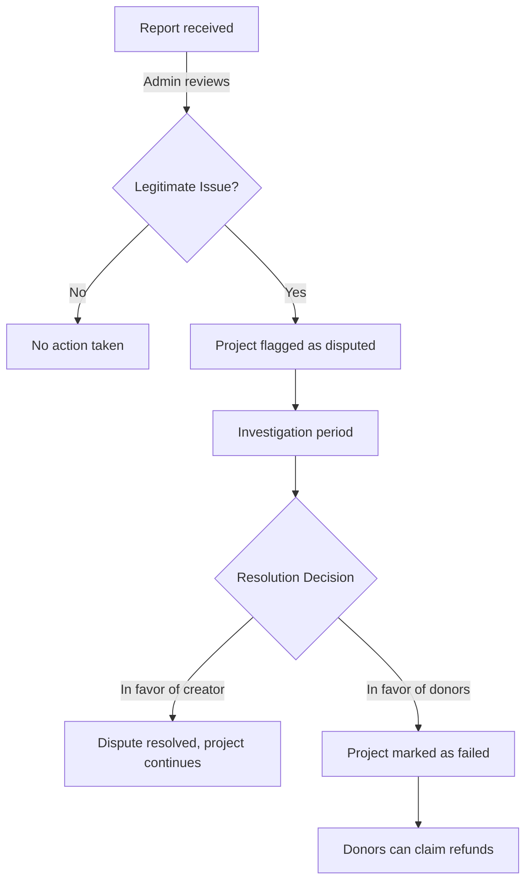
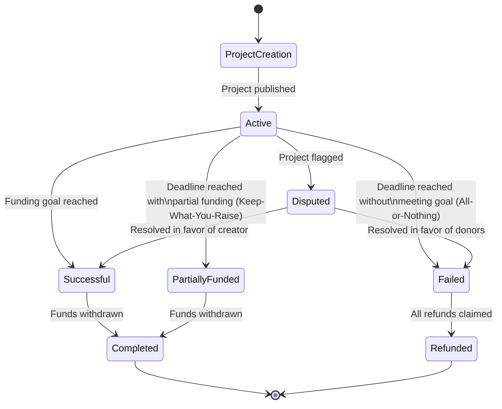
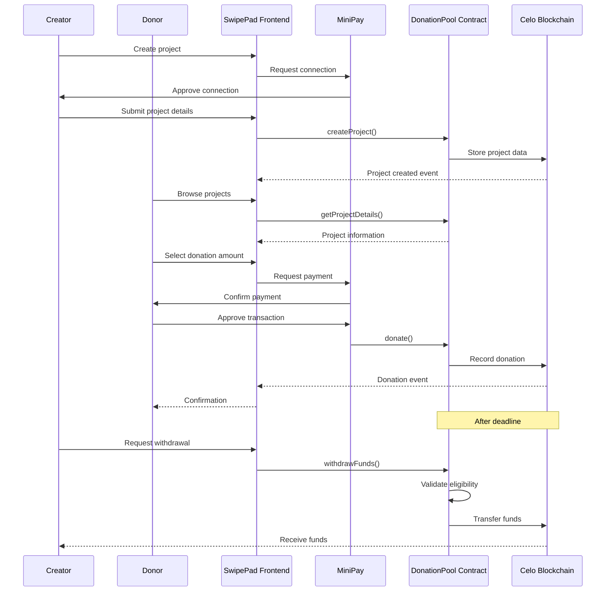

# SwipePad Donation Flow

## User Journeys

### Project Creator Journey

### Donor Journey

### Admin Dispute Resolution Journey

## Complete Donation Lifecycle

## Important Timeframes

| Event | Timeframe | Notes |
|-------|-----------|-------|
| Minimum funding period | 1 day | Projects must run for at least 24 hours |
| Maximum funding period | 180 days | Projects cannot run longer than 6 months |
| Refund grace period | 14 days | Period after project failure when refunds can be claimed |
| Dispute resolution | 7 days | Default time for admin to resolve disputes |

## Technical Flow

