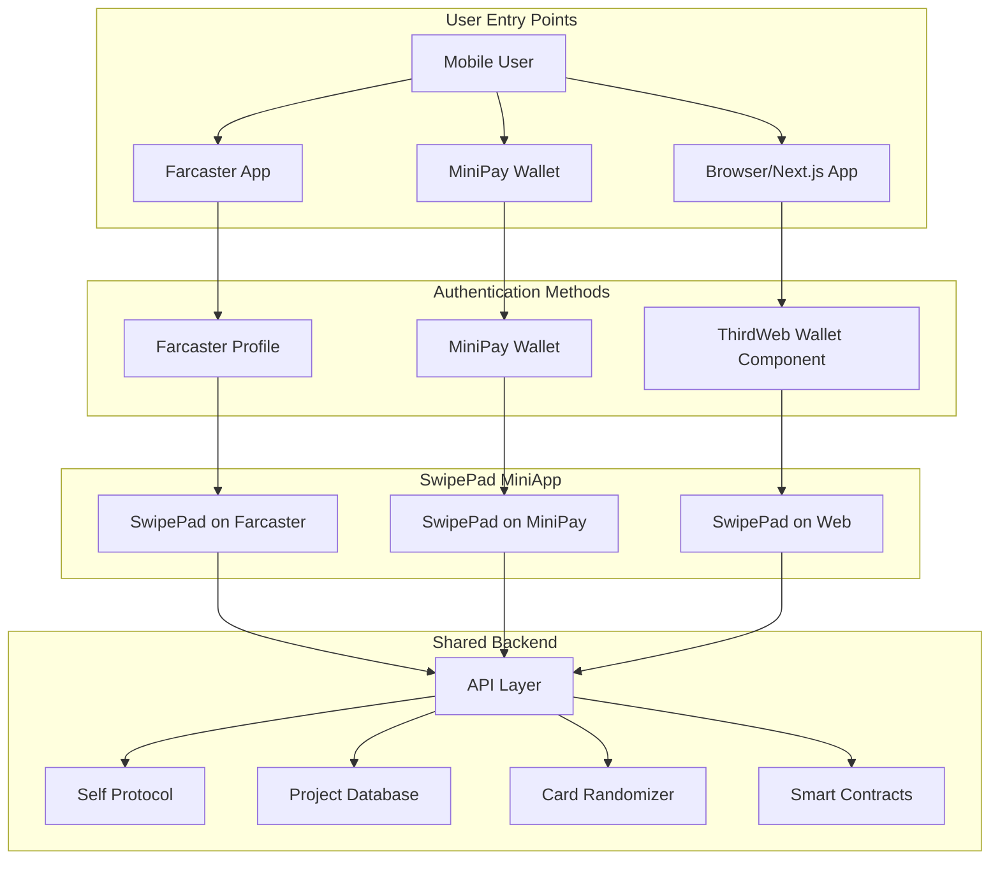

# SwipePad Architecture & User Journey Diagrams

This document contains comprehensive diagrams showing the SwipePad architecture, user flows, and integration points across all supported platforms (Farcaster, MiniPay, and Browser/Next.js).

## 1. User Entry Points & Authentication Flow


## 2. User Journey Flow

```mermaid
sequenceDiagram
    participant User
    participant Platform as Farcaster/MiniPay/Browser
    participant SwipePad
    participant Auth as Auth System
    participant SelfProtocol
    participant CardRandomizer
    participant PrivateDB
    participant ThirdWeb
    participant DonationContract
    participant ProjectWallet
    participant Divvi
    participant KarmaGAP

    %% Entry and Authentication
    User->>Platform: Opens SwipePad
    Platform->>SwipePad: Load SwipePad MiniApp
    
    alt Browser Entry
        SwipePad->>ThirdWeb: Show ThirdWeb Wallet Component
        User->>ThirdWeb: Connect Wallet
        ThirdWeb-->>SwipePad: Wallet Connected
    else Farcaster Entry
        SwipePad->>Auth: Use Farcaster Profile
        Auth-->>SwipePad: Profile Authenticated
    else MiniPay Entry
        SwipePad->>Auth: Use MiniPay Wallet
        Auth-->>SwipePad: Wallet Authenticated
    end
    
    %% Self ID Verification (Optional)
    SwipePad->>User: Show ID Verification Prompt
    alt User Chooses to Verify
        User->>SelfProtocol: Initiate ID Verification
        SelfProtocol->>User: Request Verification Data
        User->>SelfProtocol: Submit Verification Data
        SelfProtocol->>SelfProtocol: Process Verification
        SelfProtocol-->>SwipePad: Verification Complete
        SelfProtocol->>DonationContract: Update User Verification Status
        DonationContract->>User: Send Reward for Verification
    end
    
    %% Project Discovery
    SwipePad->>CardRandomizer: Request Shuffled Projects
    CardRandomizer->>PrivateDB: Fetch Project Data
    PrivateDB-->>CardRandomizer: Return Project Cards
    CardRandomizer-->>SwipePad: Return Shuffled Cards
    SwipePad->>User: Display Project Cards
    
    %% Donation Flow
    User->>SwipePad: Swipe Right (Donate)
    SwipePad->>ThirdWeb: Initiate Donation
    ThirdWeb->>DonationContract: Process Donation
    DonationContract->>ProjectWallet: Transfer Funds
    DonationContract-->>ThirdWeb: Transaction Confirmation
    ThirdWeb-->>SwipePad: Donation Successful
    
    %% Impact Tracking
    DonationContract->>Divvi: Track Donation Impact
    DonationContract->>KarmaGAP: Record Impact
    Divvi->>SwipePad: Update Impact Metrics
    KarmaGAP->>SwipePad: Update Impact Metrics
    SwipePad->>User: Display Impact Confirmation
 end
```

3. Project Submission Flow
   
```mermaid
sequenceDiagram
    participant ProjectSubmitter
    participant Platform as Farcaster/MiniPay/Browser
    participant SwipePad
    participant Auth as Auth System
    participant SelfProtocol
    participant AdminSystem
    participant ProjectRegistry
    participant PrivateDB
    participant KarmaGAP
    participant Divvi

    %% Entry and Authentication
    ProjectSubmitter->>Platform: Opens SwipePad
    Platform->>SwipePad: Load SwipePad MiniApp
    
    alt Browser Entry
        SwipePad->>Auth: Show ThirdWeb Wallet Component
        ProjectSubmitter->>Auth: Connect Wallet
        Auth-->>SwipePad: Wallet Connected
    else Farcaster Entry
        SwipePad->>Auth: Use Farcaster Profile
        Auth-->>SwipePad: Profile Authenticated
    else MiniPay Entry
        SwipePad->>Auth: Use MiniPay Wallet
        Auth-->>SwipePad: Wallet Authenticated
    end
    
    %% Mandatory Self ID Verification for Project Submission
    SwipePad->>ProjectSubmitter: Show Project Submission Form
    ProjectSubmitter->>SwipePad: Submit Project Details
    SwipePad->>SelfProtocol: Check Verification Status
    alt Not Verified
        SelfProtocol-->>SwipePad: User Not Verified
        SwipePad->>ProjectSubmitter: Require ID Verification
        ProjectSubmitter->>SelfProtocol: Initiate ID Verification
        SelfProtocol->>ProjectSubmitter: Request Verification Data
        ProjectSubmitter->>SelfProtocol: Submit Verification Data
        SelfProtocol->>SelfProtocol: Process Verification
        SelfProtocol-->>SwipePad: Verification Complete
    end
    
    %% Project Approval Process
    SwipePad->>AdminSystem: Submit Project for Review
    AdminSystem->>AdminSystem: Review Project Details
    AdminSystem->>ProjectSubmitter: Request Additional Info if Needed
    ProjectSubmitter->>AdminSystem: Provide Additional Info
    AdminSystem->>ProjectRegistry: Approve Project
    ProjectRegistry->>PrivateDB: Add Project to Database
    ProjectRegistry->>KarmaGAP: Register Project
    ProjectRegistry->>Divvi: Register Project
    PrivateDB-->>SwipePad: Project Available for Display
    SwipePad->>ProjectSubmitter: Project Submission Confirmed
end
```
    ```
4. Self Protocol Integration Flow 
