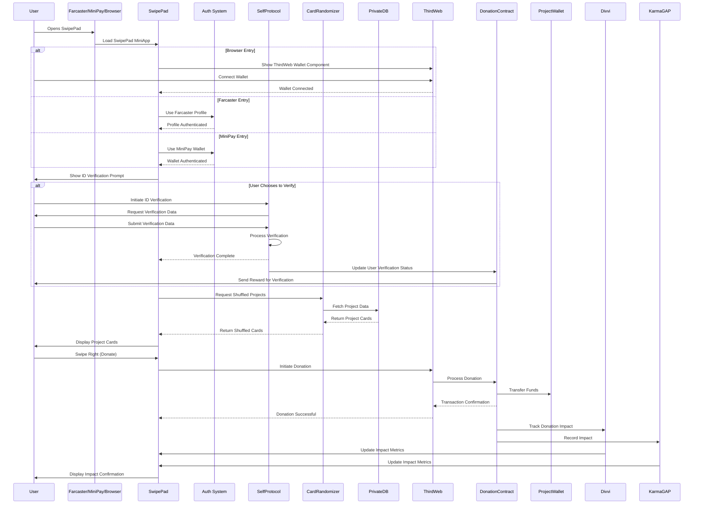
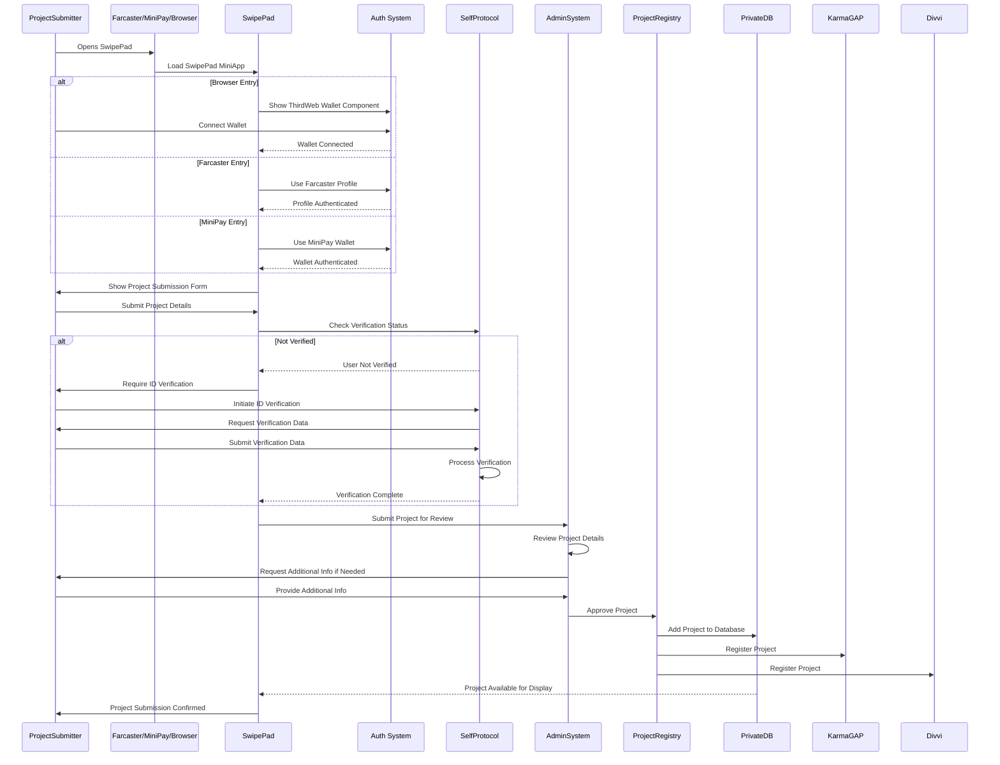
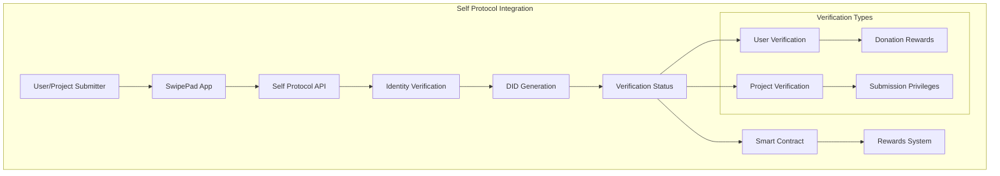
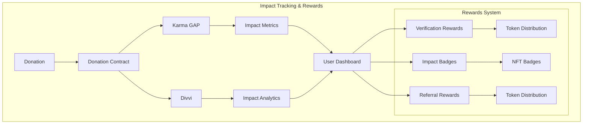
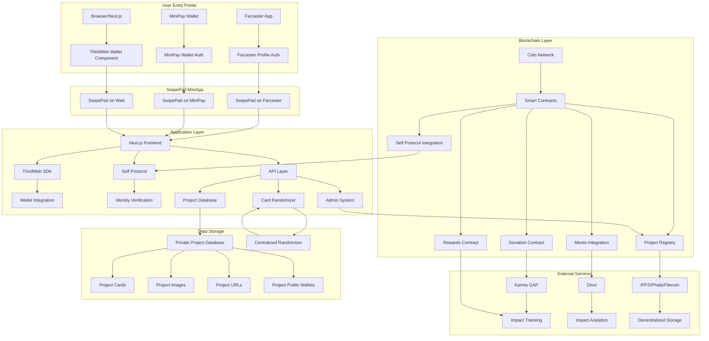
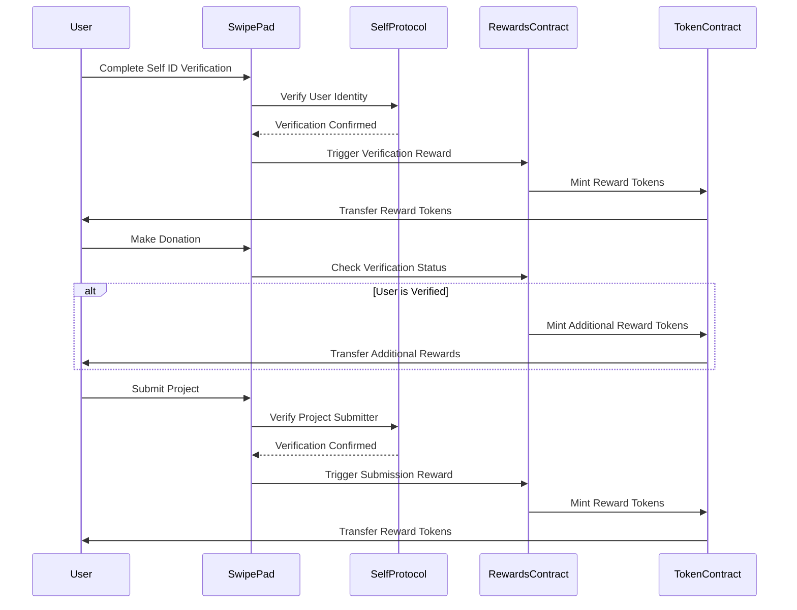

# SwipePad Architecture & User Journey Diagrams

This document contains comprehensive diagrams showing the SwipePad architecture, user flows, and integration points across all supported platforms (Farcaster, MiniPay, and Browser/Next.js).

## 1. User Entry Points & Authentication Flow

## 2. User Journey Flow

## 3. Project Submission Flow

## 4. Self Protocol Integration Flow

## 5. Impact Tracking & Rewards Flow

## 6. Complete System Architecture

## 7. Reward System Flow

